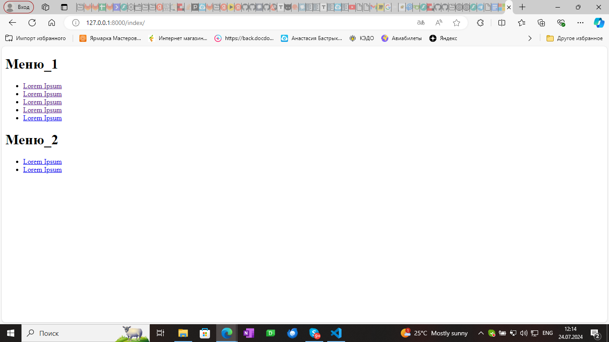

## Задача :

Нужно сделать django app, который будет реализовывать древовидное меню, соблюдая следующие условия:
1. Меню реализовано через template tag
2. Все, что над выделенным пунктом - развернуто. Первый уровень вложенности под выделенным пунктом тоже развернут.
3. Хранится в БД.
4. Редактируется в стандартной админке Django
5. Активный пункт меню определяется исходя из URL текущей страницы
6. Меню на одной странице может быть несколько. Они определяются по названию.
7. При клике на меню происходит переход по заданному в нем URL. URL может быть задан как явным образом, так и через named url.
8. На отрисовку каждого меню требуется ровно 1 запрос к БД
 Нужен django-app, который позволяет вносить в БД меню (одно или несколько) через админку, и нарисовать на любой нужной странице меню по названию.
 
 При выполнении задания из библиотек следует использовать только Django и стандартную библиотеку Python.

## Результат

Создание пользовательского тега шаблона в Django позволяет вам добавлять динамическую логику прямо в шаблоны HTML. В вашем случае, вы хотите создать тег шаблона, который будет отрисовывать древовидное меню на основе данных из базы данных. Вот пошаговый процесс создания такого тега шаблона:

* Внутри вашего Django-приложения создайте директорию с именем templatetags. Это специальная директория, которую Django автоматически проверяет на наличие пользовательских тегов шаблонов.

* Внутри директории templatetags создайте Python-файл с именем, которое описывает ваш тег шаблона, например menu_tags.py. Это имя файла будет использоваться для загрузки тега шаблона в ваших шаблонах Django.

* В начале файла menu_tags.py импортируйте модуль template из Django и создайте экземпляр класса Library, который будет использоваться для регистрации вашего тега шаблона.

* Определите функцию, которая будет содержать логику вашего тега шаблона. Эта функция должна принимать любые необходимые параметры и возвращать словарь контекста, который будет доступен в шаблоне при использовании этого тега.
* Чтобы использовать ваш новый тег шаблона в шаблоне Django, сначала нужно загрузить его с помощью тега . Затем вы можете использовать ваш тег шаблона в любом месте шаблона.

